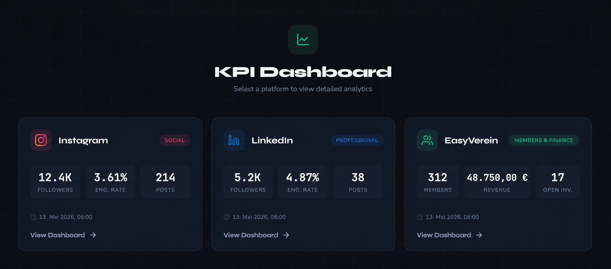
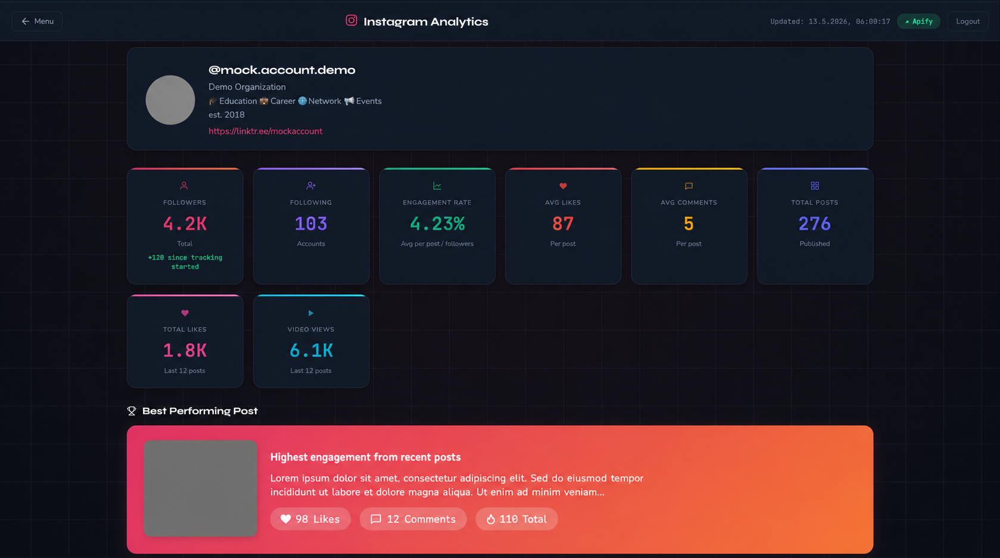

# Nonprofit KPI Dashboard

A self-hosted analytics dashboard that aggregates social media metrics and membership data for a nonprofit organization.

## Why?

I built this dashboard to support the board of my nonprofit organization (I'm Head of IT) in tracking progress and making informed decisions about future development. Instead of logging into five different platforms, the board now has a single view of all relevant KPIs — updated automatically.

## Preview




## Tech Stack

| Layer | Technology |
|-------|-----------|
| Backend | Node.js, Express |
| Scraping | Apify (Instagram & LinkedIn actors) |
| Membership Data | EasyVerein API |
| Auth | bcrypt + cookie-session (role-based) |
| Secrets | Google Cloud Secret Manager |
| Storage | Google Cloud Storage (production), local JSON (dev) |
| Hosting | Google Cloud App Engine |
| Scheduling | Google Cloud Scheduler (cron) |

## How to Run

```bash
# Clone
git clone https://github.com/<your-username>/nonprofit-kpi-dashboard.git
cd nonprofit-kpi-dashboard

# Install dependencies
npm install

# Configure environment
cp .env.example .env
# Fill in your API tokens and secrets in .env

# Start development server
npm run dev
```

### Deploy to Google App Engine

```bash
# Install the gcloud CLI: https://cloud.google.com/sdk/docs/install

# Authenticate and set your project
gcloud auth login
gcloud config set project YOUR_PROJECT_ID

# Store secrets in Secret Manager
gcloud secrets create APIFY_TOKEN --data-file=-
gcloud secrets create DASHBOARD_PASSWORD --data-file=-
# ... repeat for each secret listed below

# Deploy
gcloud app deploy
```

After deploying, set up **Cloud Scheduler** to call the cron endpoints:

```bash
# Bi-daily refresh (every 2 days)
gcloud scheduler jobs create http refresh-all \
  --schedule="0 6 */2 * *" \
  --uri="https://YOUR_PROJECT_ID.appspot.com/api/cron/refresh-all" \
  --http-method=POST \
  --headers="x-cron-secret=YOUR_CRON_SECRET"

# Monthly full rescrape (1st of each month)
gcloud scheduler jobs create http refresh-full \
  --schedule="0 4 1 * *" \
  --uri="https://YOUR_PROJECT_ID.appspot.com/api/cron/refresh-full" \
  --http-method=POST \
  --headers="x-cron-secret=YOUR_CRON_SECRET"
```

---

Required environment variables (see `.env.example`):
- `APIFY_TOKEN` — Apify API key for scraping
- `INSTAGRAM_USERNAME` — Target Instagram profile
- `LINKEDIN_COMPANY_URL` — Target LinkedIn company page
- `EASYVEREIN_SECRET` — EasyVerein API token
- `DASHBOARD_PASSWORD` — Admin login password (full access)
- `MARKETING_PASSWORD` — Marketing login password (Instagram & LinkedIn only)
- `SESSION_SECRET` — Cookie signing key
- `CRON_SECRET` — Shared secret for scheduled jobs

## Architecture

```
┌─────────────┐       ┌──────────────────────┐
│  Browser    │──────▶│  Express Server      │
│  (Frontend) │◀──────│  (Auth + Routes)     │
└─────────────┘       └──────────┬───────────┘
                                 │
                 ┌───────────────┼───────────────┐
                 ▼               ▼               ▼
        ┌──────────────┐ ┌─────────────┐ ┌─────────────┐
        │ Apify API    │ │ Apify API   │ │ EasyVerein  │
        │ (Instagram)  │ │ (LinkedIn)  │ │ API         │
        └──────────────┘ └─────────────┘ └─────────────┘

        ┌──────────────────────────────────────────────┐
        │         Google Cloud Platform                 │
        │  ┌────────────┐ ┌──────────┐ ┌───────────┐  │
        │  │ App Engine │ │ Cloud    │ │ Secret    │  │
        │  │ (Hosting)  │ │ Storage  │ │ Manager   │  │
        │  └────────────┘ └──────────┘ └───────────┘  │
        │  ┌─────────────────┐                         │
        │  │ Cloud Scheduler │─── POST /api/cron/*     │
        │  └─────────────────┘                         │
        └──────────────────────────────────────────────┘
```

**Data flow:**
1. Cloud Scheduler triggers `/api/cron/refresh-all` every 2 days
2. Server calls Apify actors to scrape Instagram/LinkedIn data
3. EasyVerein API provides membership stats
4. Results are cached locally (dev) or in Cloud Storage (prod)
5. Frontend fetches cached data and renders charts

## Finance KPIs

A dedicated finance analytics page (`/finance`) provides deep insights into the club's financial health, computed from EasyVerein booking data:

**Revenue Diversification** — Automatic classification of all income into:
- Member Fees (incl. SumUp bulk collections)
- Sponsoring (invoice-based payments)
- Travel Deposits (city trips, conferences)
- Merch (apparel sales)

**Expense Breakdown** — Categorized spending:
- Stammtische / Food
- Travel
- Events (uni camp, sport activities)
- Subscriptions
- Merch (production costs)

**Membership Analytics:**
- Year-over-year member growth with absolute and percentage change
- Average membership duration (overall, active, resigned)

All KPIs support year selection and show both current-year and all-time splits. Classification is keyword-based on booking descriptions.

## Results

- Automated data collection every 2 days with zero manual effort
- Full monthly rescrape ensures data integrity
- Sub-second page loads via cached JSON responses
- Role-based access: admin sees everything, marketing sees only social media KPIs

## What I Learned / What's Next

**Learned:**
- Setting up Google Cloud Scheduler cron jobs to trigger authenticated endpoints on App Engine
- Using Apify's scraping API as a reliable alternative to brittle direct scraping — handles rate limits, CAPTCHAs, and platform changes
- Designing a secret management flow that works both locally (`.env`) and in production (GCP Secret Manager)

**What's next:**
- Add automated posting to social platforms
- Improve expense classification (many debit card entries lack descriptions)
- Add budget tracking when budget data becomes available
